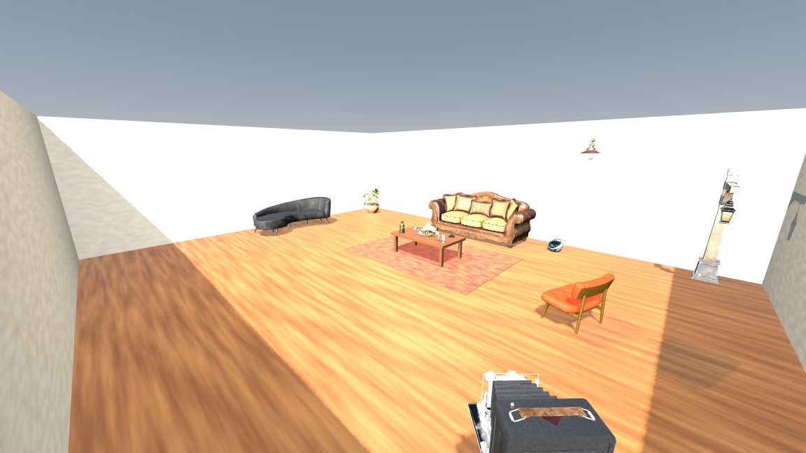

# VR Lab 1 – Living Room

Small living room scene made in Godot 4.7 for the Virtual Reality Modeling course.

- 13 textured props with collisions
- first-person player

**Controls:** WASD to move, mouse to look, Shift to run, Space to jump, Esc to release the mouse.

Model sources and licenses are in [MODEL_SOURCES.txt](MODEL_SOURCES.txt).
