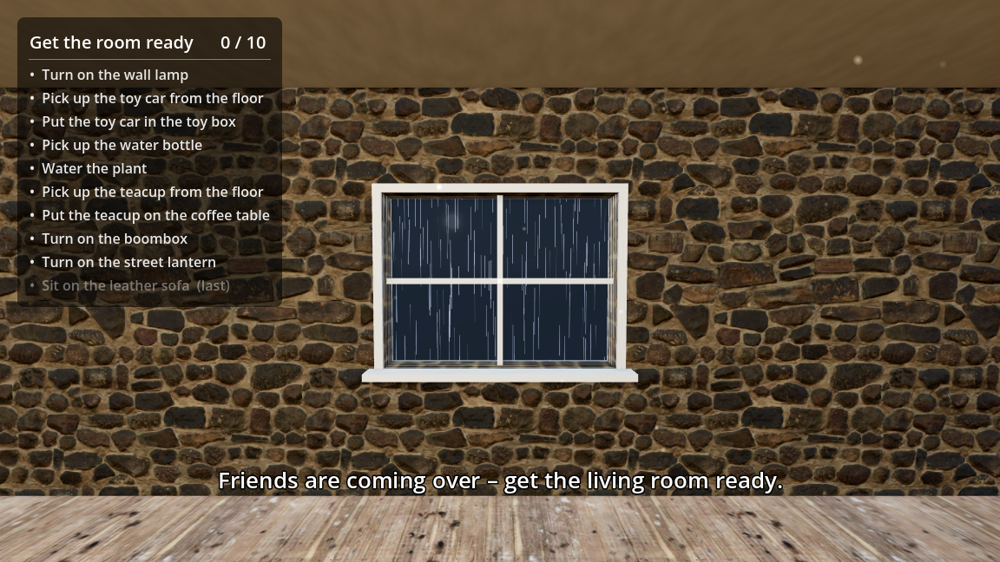

# VR Labs – Living Room

Living room scene made in Godot 4.7 for the Virtual Reality Modeling course.

## Lab 1 – Environment
- 12 textured props with collisions (`scenes/main.tscn`)

## Lab 2 – Interactions

- First-person controller with look-at interaction (`scenes/lab2.tscn`)
- A 10-task checklist: turn on the lamp, tidy up the toy car and teacup, water the plant, turn on the music and the lantern, and sit down
- Tasks can be done in any order, with natural dependencies: an item has to be picked up before it can be placed or used, and sitting on the sofa is always the last task
- Everything you can do right now glows in the scene; trying something not yet possible shows a hint

## Lab 3 – Immersion and feedback

- Runs by default (`scenes/lab3.tscn`)
- Feedback on every interaction: switch clicks and a flickering bulb, a flickering lantern with embers, pick-up and placing sounds, a dust puff from the toy box, a clink and sparkle for the teacup, pouring sound and water drops (the bottle flies over to the plant and back), music notes from the boombox and a cushion sound on the sofa
- A chime when a task is done and a short error sound when something isn't possible yet
- Ambient effects: rain outside a new window with rain sound, thunder with lightning flashes, dust motes in the air, steam from the teacup, a ticking wall clock that shows the real time, a quiet room hum and footsteps on the wooden floor

**Controls:** WASD to move, mouse to look, Shift to run, Space to jump, E to interact, R to restart when done, Esc to release the mouse.

Asset list (models, textures and sounds): [MODEL_SOURCES.txt](MODEL_SOURCES.txt). No asset packages were used.
